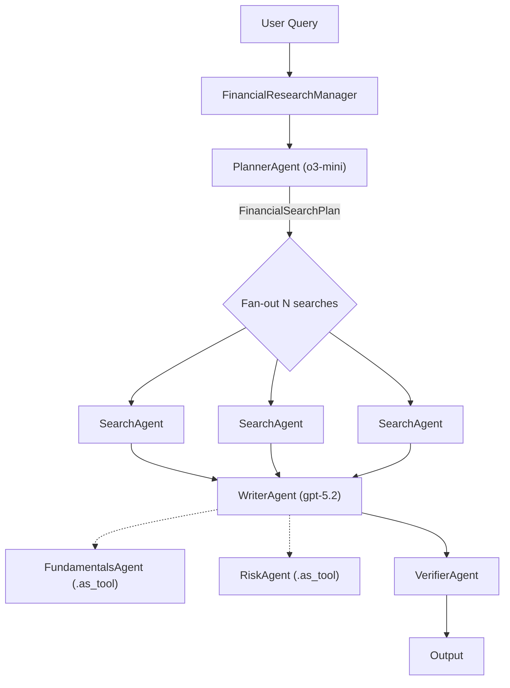
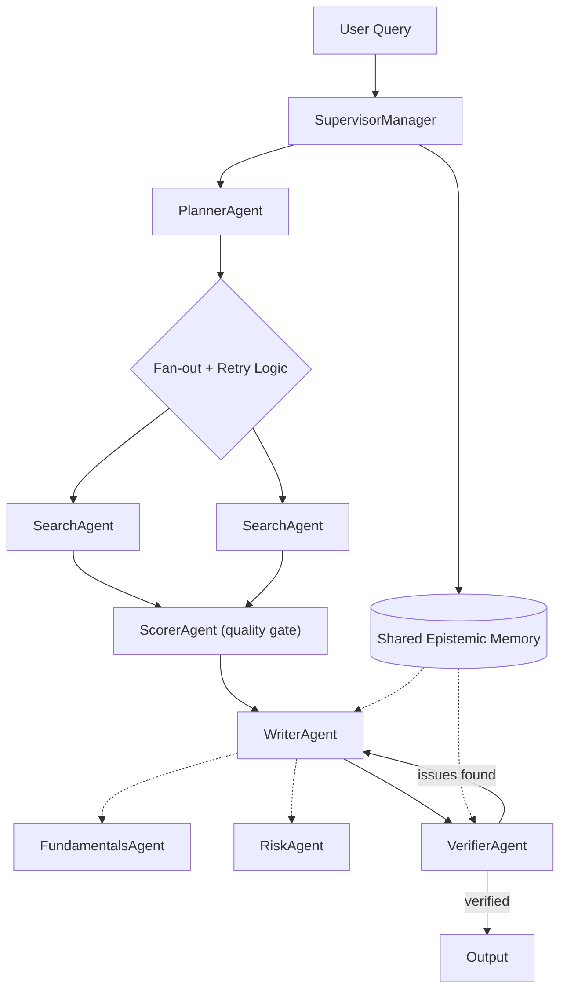

# Iconsult MCP: "I make my living as an AI consultant"

**Finally, an AI consultant that actually read the book.**

While other "AI consultants" are busy rephrasing your requirements back to you at $400/hour, Iconsult has ingested an entire textbook on multi-agent architecture, built a knowledge graph of 141 concepts and 462 relationships, and will give you evidence-backed pattern recommendations in under a second. No slide deck. No "circle back." No invoice.

## See It In Action

We pointed Iconsult at OpenAI's [Financial Research Agent](https://github.com/openai/openai-agents-python/tree/main/examples/financial_research_agent) — a 5-stage multi-agent pipeline from their Agents SDK — and asked it to find architectural gaps.

[](https://www.youtube.com/watch?v=GWzlYf5MsHM)

**[View the full interactive architecture review →](https://marcus-waldman.github.io/Iconsult_mcp/openai-financial-agent-review.html)**

### The agent's current architecture

The Financial Research Agent uses a **5-stage sequential pipeline** orchestrated by `FinancialResearchManager`. Search is the only concurrent stage — everything else runs in sequence, and the verifier is a terminal dead end:



### What Iconsult found

Solid foundation, but Iconsult's knowledge graph traversal uncovered 4 critical gaps:

| # | Gap | Missing Pattern | Book Reference |
|---|-----|----------------|----------------|
| R1 | Verifier flags issues but pipeline terminates — no self-correction | Auto-Healing Agent Resuscitation | Ch. 7, p. 216 |
| R2 | Raw search results pass unfiltered to writer | Hybrid Planner+Scorer | Ch. 12, pp. 387-390 |
| R3 | All agents share same trust level — no capability boundaries | Supervision Tree with Guarded Capabilities | Ch. 5, pp. 142-145 |
| R4 | Zero reliability patterns composed (book recommends 2-3 minimum) | Shared Epistemic Memory + Persistent Instruction Anchoring | Ch. 6, p. 203 |

### Recommended architecture

Adding a feedback loop, quality gate, shared memory, and retry logic:



### How it got there

The consultation followed Iconsult's 5-step workflow:

1. **Read the codebase** — Fetched all source files from `manager.py`, `agents/*.py`. Identified the orchestrator pattern in `FinancialResearchManager`, the `.as_tool()` composition, the silent `except Exception: return None` in search, and the terminal verifier.

2. **Map to concepts** — `list_concepts` matched the codebase to: Orchestrator, Planner-Worker, Agent Delegates to Agent, Tool Use, and Supervisor patterns.

3. **Traverse the graph** — `get_subgraph` explored each seed concept's neighborhood. The `requires` edges revealed that the Supervisor pattern *requires* Auto-Healing — which was entirely missing. The `complements` edges surfaced Hybrid Planner+Scorer as a natural addition.

4. **Retrieve book passages** — `ask_book` scoped to the discovered concepts returned exact citations: chapter numbers, page ranges, and quotes grounding each recommendation.

5. **Synthesize** — Generated the [interactive before/after architecture diagram](https://marcus-waldman.github.io/Iconsult_mcp/openai-financial-agent-review.html) with specific file-level changes, prerequisite checks, and conflict analysis. All recommended patterns are complementary — no conflicts detected.

## What It Does

Iconsult is an MCP server that acts as a technical architecture advisor for multi-agent systems. It's backed by a knowledge graph extracted from *Agentic Architectural Patterns for Building Multi-Agent Systems* (Arsanjani & Bustos, Packt 2026) — meaning every recommendation comes with page numbers, not vibes.

### Tools

| Tool | What it does |
|------|-------------|
| `list_concepts` | Browse all 138 concepts in the knowledge graph — your entry point for mapping patterns to concept IDs |
| `get_subgraph` | Traverse the graph from seed concepts — discovers alternatives, prerequisites, conflicts, and complements |
| `ask_book` | RAG search against the book — returns passages with chapter, page numbers, and full text |
| `health_check` | Verify the server is running and the graph is intact |

### Prompt

| Prompt | What it does |
|--------|-------------|
| `consult` | Kick off a full architecture consultation — provide your project context and get the guided workflow |

### The Knowledge Graph

```
141 concepts  ·  786 sections  ·  462 relationships  ·  1,248 concept-section mappings
```

Relationship types span `uses`, `extends`, `alternative_to`, `component_of`, `requires`, `enables`, `complements`, `specializes`, `precedes`, and `conflicts_with` — discovered through five extraction phases including cross-chapter semantic analysis.

**[Explore the interactive knowledge graph →](https://marcus-waldman.github.io/Iconsult_mcp/)**

## Setup

### Prerequisites

- Python 3.10+
- A [MotherDuck](https://motherduck.com) account (free tier works)
- OpenAI API key (for embeddings used by `ask_book`)
- **Claude Code** with the [visual-explainer](https://github.com/nicobailon/visual-explainer) skill installed (required for architecture diagram rendering — see below)

### Database Access

The knowledge graph is hosted on MotherDuck and shared publicly. The server automatically detects whether you own the database or need to attach the public share — no extra configuration needed. Just provide your MotherDuck token and it works.

### Install visual-explainer (Claude Code skill)

Iconsult renders architecture diagrams as interactive HTML pages using the [visual-explainer](https://github.com/nicobailon/visual-explainer) skill. Install it once:

```bash
git clone https://github.com/nicobailon/visual-explainer.git ~/.claude/skills/visual-explainer
mkdir -p ~/.claude/commands
cp ~/.claude/skills/visual-explainer/prompts/*.md ~/.claude/commands/
```

This gives Claude Code the `/generate-web-diagram` command used during consultations. Diagrams are written to `~/.agent/diagrams/` and opened in your browser automatically.

### Install

```bash
pip install git+https://github.com/marcus-waldman/Iconsult_mcp.git
```

For development:

```bash
git clone https://github.com/marcus-waldman/Iconsult_mcp.git
cd Iconsult_mcp
pip install -e .
```

### Environment Variables

```bash
export MOTHERDUCK_TOKEN="your-token"    # Required — database
export OPENAI_API_KEY="sk-..."          # Required — embeddings for ask_book
```

### MCP Configuration

Add to your Claude Desktop config (`claude_desktop_config.json`) or Claude Code settings:

```json
{
  "mcpServers": {
    "iconsult": {
      "command": "iconsult-mcp",
      "env": {
        "MOTHERDUCK_TOKEN": "your-token",
        "OPENAI_API_KEY": "sk-..."
      }
    }
  }
}
```

### Verify

```bash
iconsult-mcp --check
```

## License

MIT
