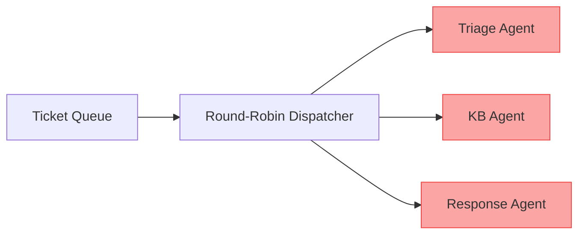
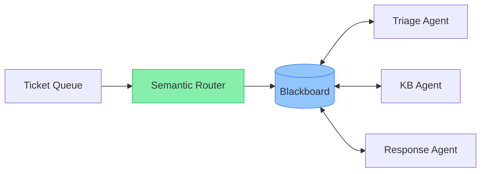

# Iconsult MCP: "I make my living as an AI consultant"

**Finally, an AI consultant that actually read the book.**

While other "AI consultants" are busy rephrasing your requirements back to you at $400/hour, Iconsult has ingested an entire textbook on multi-agent architecture, built a knowledge graph of 141 concepts and 462 relationships, and will give you evidence-backed pattern recommendations in under a second. No slide deck. No "circle back." No invoice.

## What It Does

Iconsult is an MCP server that acts as a technical architecture advisor for multi-agent systems. It's backed by a knowledge graph extracted from *Agentic Architectural Patterns for Building Multi-Agent Systems* (Arsanjani & Bustos, Packt 2026) — meaning every recommendation comes with page numbers, not vibes.

### Tools

| Tool | What it does |
|------|-------------|
| `list_concepts` | Browse all 138 concepts in the knowledge graph — your entry point for mapping patterns to concept IDs |
| `get_subgraph` | Traverse the graph from seed concepts — discovers alternatives, prerequisites, conflicts, and complements |
| `ask_book` | RAG search against the book — returns passages with chapter, page numbers, and full text |
| `health_check` | Verify the server is running and the graph is intact |

### Prompt

| Prompt | What it does |
|--------|-------------|
| `consult` | Kick off a full architecture consultation — provide your project context and get the guided workflow |

### The Knowledge Graph

```
141 concepts  ·  786 sections  ·  462 relationships  ·  1,248 concept-section mappings
```

Relationship types span `uses`, `extends`, `alternative_to`, `component_of`, `requires`, `enables`, `complements`, `specializes`, `precedes`, and `conflicts_with` — discovered through five extraction phases including cross-chapter semantic analysis.

**[Explore the interactive knowledge graph →](https://marcus-waldman.github.io/Iconsult_mcp/)**

## Setup

### Prerequisites

- Python 3.10+
- A [MotherDuck](https://motherduck.com) account (free tier works)
- OpenAI API key (for embeddings used by `ask_book`)
- **Claude Code** with the [visual-explainer](https://github.com/nicobailon/visual-explainer) skill installed (required for architecture diagram rendering — see below)

### Database Access

The knowledge graph is hosted on MotherDuck and shared publicly. The server automatically detects whether you own the database or need to attach the public share — no extra configuration needed. Just provide your MotherDuck token and it works.

### Install visual-explainer (Claude Code skill)

Iconsult renders architecture diagrams as interactive HTML pages using the [visual-explainer](https://github.com/nicobailon/visual-explainer) skill. Install it once:

```bash
git clone https://github.com/nicobailon/visual-explainer.git ~/.claude/skills/visual-explainer
mkdir -p ~/.claude/commands
cp ~/.claude/skills/visual-explainer/prompts/*.md ~/.claude/commands/
```

This gives Claude Code the `/generate-web-diagram` command used during consultations. Diagrams are written to `~/.agent/diagrams/` and opened in your browser automatically.

### Install

```bash
pip install git+https://github.com/marcus-waldman/Iconsult_mcp.git
```

For development (after cloning):

```bash
pip install -e .
```

### Environment Variables

```bash
export MOTHERDUCK_TOKEN="your-token"    # Required — database
export OPENAI_API_KEY="sk-..."          # Required — embeddings for ask_book
```

### MCP Configuration

Add to your Claude Desktop config (`claude_desktop_config.json`) or Claude Code settings:

```json
{
  "mcpServers": {
    "iconsult": {
      "command": "iconsult-mcp",
      "env": {
        "MOTHERDUCK_TOKEN": "your-token",
        "OPENAI_API_KEY": "sk-..."
      }
    }
  }
}
```

### Verify

```bash
iconsult-mcp --check
```

## Usage Example

Here's what a typical consultation looks like. You describe your architecture problem, and Claude uses the knowledge graph to deliver grounded, project-specific advice.

---

**You:**

> I'm building a customer support system where multiple AI agents handle tickets — one triages, one looks up knowledge base articles, and one drafts responses. They're all independent right now and I'm having coordination problems. Can you help me improve the architecture?

**Claude:**

Let me start by reading your codebase to understand the current setup.

*\[Reads project files — finds `triage_agent.py`, `kb_agent.py`, `response_agent.py`, `main.py` with a simple round-robin dispatcher\]*

I can see you have three independent agents dispatched via round-robin in `main.py:42`. There's no shared state or coordination — each agent fires and forgets. Let me map this to the knowledge graph.

*\[Calls `list_concepts` — scans the 138 concepts, identifies matches\]*

Your setup maps to several concepts:
- `c_047` Multi-Agent Orchestration
- `c_031` Task Routing Pattern
- `c_089` Agent Specialization

Let me explore what the graph says about improving coordination.

*\[Calls `get_subgraph(concept_ids=["c_047", "c_031", "c_089"], max_hops=2)`\]*

Interesting findings from the graph:
- `c_047` → **requires** → `c_052` (Shared Memory / Blackboard)
- `c_047` → **alternative_to** → `c_061` (Hierarchical Delegation)
- `c_031` → **extends** → `c_033` (Semantic Router)
- `c_089` → **complements** → `c_055` (Agent Communication Protocol)
- `c_061` → **conflicts_with** → `c_072` (Fully Decentralized Swarm)

Your round-robin dispatcher is a basic Task Router (`c_031`), but you're missing the Shared Memory (`c_052`) that Multi-Agent Orchestration *requires*. Let me get the book's guidance.

*\[Calls `ask_book(question="How should agents share state in an orchestrated multi-agent system?", concept_ids=["c_047", "c_052", "c_055"])`\]*

Based on the book (Chapter 7, pp. 184–189):

> "An orchestrated multi-agent system without shared state degenerates into parallel independent execution — agents cannot build on each other's work."

Here's my recommendation:

*\[Calls `/generate-web-diagram` — generates a self-contained HTML file with Mermaid diagrams and opens it in the browser\]*

**Before:**



**After:**



**Specific changes:**
1. **`main.py:42`** — Replace round-robin with a Semantic Router (`c_033`) that routes by ticket intent, not rotation
2. **New `blackboard.py`** — Add a shared state store so Triage writes classification, KB reads it to scope search, and Response reads both to draft with context
3. **`response_agent.py:15`** — Read triage classification + KB articles from blackboard before drafting

**Prerequisites met:** Your agents are already specialized (`c_089`) ✓
**Conflict check:** No conflicts — blackboard is compatible with all your current patterns ✓
**Alternative considered:** Hierarchical Delegation (`c_061`) would also work but adds a supervisor agent you don't need yet at this scale.

Want me to dive deeper into any of these changes?

---

Every recommendation traces back to the book. Every pattern gets checked for prerequisites and conflicts. No hallucinated best practices — just the graph.

## License

MIT
