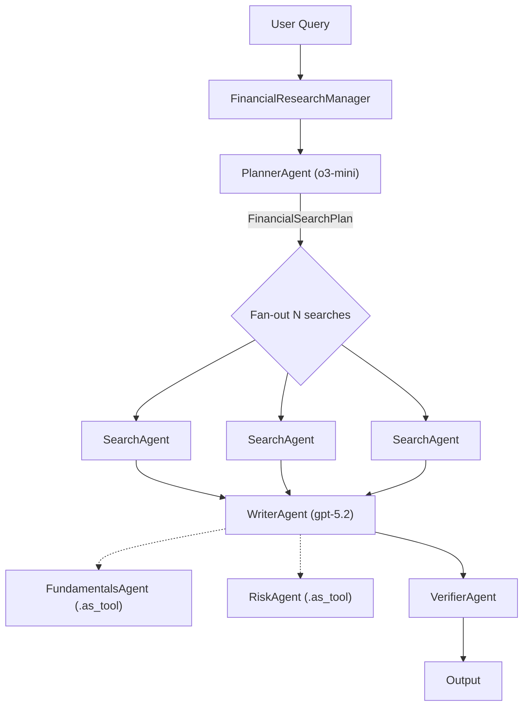
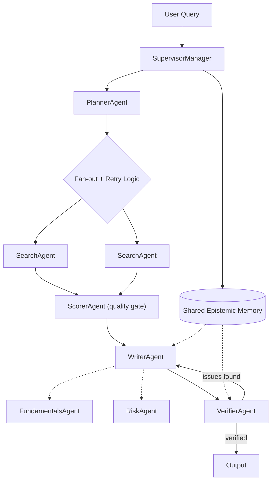

# Iconsult MCP

**Architecture consulting for multi-agent systems, grounded in the textbook.**

Iconsult is an MCP server that reviews your multi-agent architecture against a knowledge graph of 141 concepts and 462 relationships extracted from *Agentic Architectural Patterns for Building Multi-Agent Systems* (Arsanjani & Bustos, Packt 2026). Every recommendation comes with chapter numbers, page references, and concrete code-level changes — not abstract advice.

## See It In Action

We pointed Iconsult at OpenAI's [Financial Research Agent](https://github.com/openai/openai-agents-python/tree/main/examples/financial_research_agent) — a 5-stage multi-agent pipeline from their Agents SDK — and asked it to assess architectural maturity.

[](https://www.youtube.com/watch?v=GWzlYf5MsHM)

**[View the full interactive architecture review →](https://marcus-waldman.github.io/Iconsult_mcp/openai-financial-agent-review.html)**

### The agent's current architecture

The Financial Research Agent uses a **5-stage sequential pipeline** orchestrated by `FinancialResearchManager`. Search is the only concurrent stage — everything else runs in sequence, and the verifier is a terminal dead end:


```mermaid
flowchart TD
    Q["User Query"] --> MGR["FinancialResearchManager"]
    MGR --> PLAN["PlannerAgent (o3-mini)"]
    PLAN -->|"FinancialSearchPlan"| FAN{"Fan-out N searches"}
    FAN --> S1["SearchAgent"]
    FAN --> S2["SearchAgent"]
    FAN --> SN["SearchAgent"]
    S1 --> W["WriterAgent (gpt-5.2)"]
    S2 --> W
    SN --> W
    W -.-> FA["FundamentalsAgent (.as_tool)"]
    W -.-> RA["RiskAgent (.as_tool)"]
    W --> V["VerifierAgent"]
    V --> OUT["Output"]
```

### What Iconsult found

Solid foundation — and Iconsult's knowledge graph traversal identified 4 key opportunities for growth:

| # | Finding | Recommended Pattern | Book Reference |
|---|-----|----------------|----------------|
| R1 | Verifier flags issues but pipeline terminates — no self-correction | Auto-Healing Agent Resuscitation | Ch. 7, p. 216 |
| R2 | Raw search results pass unfiltered to writer | Hybrid Planner+Scorer | Ch. 12, pp. 387-390 |
| R3 | All agents share same trust level — no capability boundaries | Supervision Tree with Guarded Capabilities | Ch. 5, pp. 142-145 |
| R4 | Zero reliability patterns composed (book recommends 2-3 minimum) | Shared Epistemic Memory + Persistent Instruction Anchoring | Ch. 6, p. 203 |

### Recommended architecture

The natural next evolution — adding a feedback loop, quality gate, shared memory, and retry logic:


```mermaid
flowchart TD
    Q["User Query"] --> SUP["SupervisorManager"]
    SUP --> MEM[("Shared Epistemic Memory")]
    SUP --> PLAN["PlannerAgent"]
    PLAN --> FAN{"Fan-out + Retry Logic"}
    FAN --> S1["SearchAgent"]
    FAN --> S2["SearchAgent"]
    S1 & S2 --> SCR["ScorerAgent (quality gate)"]
    SCR --> W["WriterAgent"]
    W -.-> FA["FundamentalsAgent"]
    W -.-> RA["RiskAgent"]
    W --> V["VerifierAgent"]
    V -->|"issues found"| W
    V -->|"verified"| OUT["Output"]
    MEM -.-> W
    MEM -.-> V
```

### How it got there

The consultation followed Iconsult's guided workflow:

1. **Read the codebase** — Fetched all source files from `manager.py`, `agents/*.py`. Identified the orchestrator pattern in `FinancialResearchManager`, the `.as_tool()` composition, the broad `except Exception: return None` in search, and the terminal verifier.

2. **Match concepts** — `match_concepts` embedded the project description and deterministically ranked the most relevant patterns: Orchestrator, Planner-Worker, Agent Delegates to Agent, Tool Use, and Supervisor.

2b. **Plan** — `plan_consultation` assessed complexity and generated an adaptive plan — how many concepts to traverse, whether to use subagents, and which critique steps to include.

3. **Traverse the graph** — `get_subgraph` explored each seed concept's neighborhood. The `requires` edges revealed that the Supervisor pattern *requires* Auto-Healing — an opportunity not yet in place. The `complements` edges surfaced Hybrid Planner+Scorer as a natural addition. `log_pattern_assessment` recorded each finding for deterministic scoring.

4. **Retrieve book passages** — `ask_book` scoped to the discovered concepts returned exact citations: chapter numbers, page ranges, and quotes grounding each recommendation.

5. **Score + stress test + synthesize** — `score_architecture` computed the maturity scorecard from logged assessments. `generate_failure_scenarios` produced concrete resilience scenarios for each opportunity — illustrating how the architecture responds under stress and where it would benefit from additional patterns. Then `render_report` generated the [interactive before/after architecture diagram](https://marcus-waldman.github.io/Iconsult_mcp/openai-financial-agent-review.html) server-side — pulling scores, scenarios, and coverage from the database and merging with narrative content to produce the complete HTML report with zoom controls, SVG tooltips, and animations. All recommended patterns are complementary — no conflicts detected.

## What It Does

Point it at a codebase (or describe your architecture), and it runs a structured consultation: matching concepts, traversing the knowledge graph for prerequisites and conflicts, scoring maturity against a 6-level model, and generating an interactive HTML review with before/after architecture diagrams.

### Tools (25)

**Consultation workflow:**

| Tool | Role | What it does |
|------|------|-------------|
| `match_concepts` | Entry point | Embeds a project description → deterministic concept ranking + `consultation_id` for session tracking |
| `plan_consultation` | Planning | Assesses complexity (simple/moderate/complex) and generates an adaptive step-by-step plan |
| `get_subgraph` | Graph traversal | Priority-queue BFS from seed concepts — discovers alternatives, prerequisites, conflicts, complements |
| `log_pattern_assessment` | Assessment | Records whether each pattern is implemented, partial, missing, or not applicable |
| `ask_book` | Deep context | RAG search against the book — returns passages with chapter, page numbers, and full text |
| `consultation_report` | Coverage | Computes concept/relationship coverage, identifies opportunities, optionally diffs two sessions |
| `score_architecture` | Scoring | Deterministic maturity scorecard (L1–L6) from logged pattern assessments; pattern ID aliases bridge KG ↔ maturity model IDs |
| `generate_failure_scenarios` | Resilience analysis | Resilience scenarios for each opportunity — code-grounded or book-grounded, with Ch. 7 recovery chain mapping |
| `critique_consultation` | Quality | Structural critique with actionable fix suggestions; multi-iteration mode (1-3 passes) with convergence detection |
| `render_report` | Report rendering | Server-side HTML rendering — pulls scores/scenarios/coverage from DB, merges with narrative content, writes complete HTML with CSS/JS/zoom/tooltips |
| `supervise_consultation` | Supervision | Tracks workflow progress across 9 phases, suggests next action with tool + params |
| `generate_implementation_plan` | Implementation | Phased markdown checklist from consultation results; classifies steps as mechanical or design decision |
| `get_implementation_plan` | Implementation | Retrieve a previously generated plan with progress summary |
| `update_plan_step` | Implementation | Update step status (pending/in_progress/completed/skipped); recomputes summary |

**Coordination:**

| Tool | What it does |
|------|-------------|
| `write_state` / `read_state` | Shared key-value state for subagent coordination during traversal |
| `assert_fact` / `query_facts` | Blackboard Knowledge Hub — typed, versioned facts with conflict detection, confidence scores, and TTL |
| `emit_event` / `get_events` | Event-driven reactivity — emit events like `gap_found`, poll with filters, get reactive suggestions |

**Quality & utility:**

| Tool | What it does |
|------|-------------|
| `rate_consultation` | Record user quality score (1-5) and/or feedback with metadata snapshot |
| `consultation_analytics` | Surface quality trends across consultations (avg rating, coverage, distribution) |
| `list_concepts` | Browse/filter the full 138-concept catalogue |
| `validate_subagent` | Schema validation for subagent responses; optional semantic validation against the knowledge graph |
| `health_check` | Server health + graph stats |

### Prompt

| Prompt | What it does |
|--------|-------------|
| `consult` | Kick off a full architecture consultation — provide your project context and get the guided workflow |

### The Knowledge Graph

```
141 concepts  ·  786 sections  ·  462 relationships  ·  1,248 concept-section mappings
```

Relationship types span `uses`, `extends`, `alternative_to`, `component_of`, `requires`, `enables`, `complements`, `specializes`, `precedes`, and `conflicts_with` — discovered through five extraction phases including cross-chapter semantic analysis.

**[Explore the interactive knowledge graph →](https://marcus-waldman.github.io/Iconsult_mcp/)**

## Setup

### Prerequisites

- Python 3.10+
- A [MotherDuck](https://motherduck.com) account (free tier works)
- OpenAI API key (for embeddings used by `ask_book`)
- **Claude Code** (optionally with the [visual-explainer](https://github.com/nicobailon/visual-explainer) skill for ad-hoc diagrams outside consultations)

### Database Access

The knowledge graph is hosted on MotherDuck and shared publicly. The server automatically detects whether you own the database or need to attach the public share — no extra configuration needed. Just provide your MotherDuck token and it works.

### Install visual-explainer (optional)

The [visual-explainer](https://github.com/nicobailon/visual-explainer) skill is no longer required for consultations — `render_report` now handles HTML rendering server-side. However, it remains useful for ad-hoc diagrams outside consultations:

```bash
git clone https://github.com/nicobailon/visual-explainer.git ~/.claude/skills/visual-explainer
mkdir -p ~/.claude/commands
cp ~/.claude/skills/visual-explainer/prompts/*.md ~/.claude/commands/
```

### Install

```bash
pip install git+https://github.com/marcus-waldman/Iconsult_mcp.git
```

For development:

```bash
git clone https://github.com/marcus-waldman/Iconsult_mcp.git
cd Iconsult_mcp
pip install -e .
```

### Environment Variables

```bash
export MOTHERDUCK_TOKEN="your-token"    # Required — database
export OPENAI_API_KEY="sk-..."          # Required — embeddings for ask_book
```

### MCP Configuration

Add to your Claude Desktop config (`claude_desktop_config.json`) or Claude Code settings:

```json
{
  "mcpServers": {
    "iconsult": {
      "command": "iconsult-mcp",
      "env": {
        "MOTHERDUCK_TOKEN": "your-token",
        "OPENAI_API_KEY": "sk-..."
      }
    }
  }
}
```

### Verify

```bash
iconsult-mcp --check
```

## License

AGPL-3.0 — see [LICENSE](LICENSE) for details.
