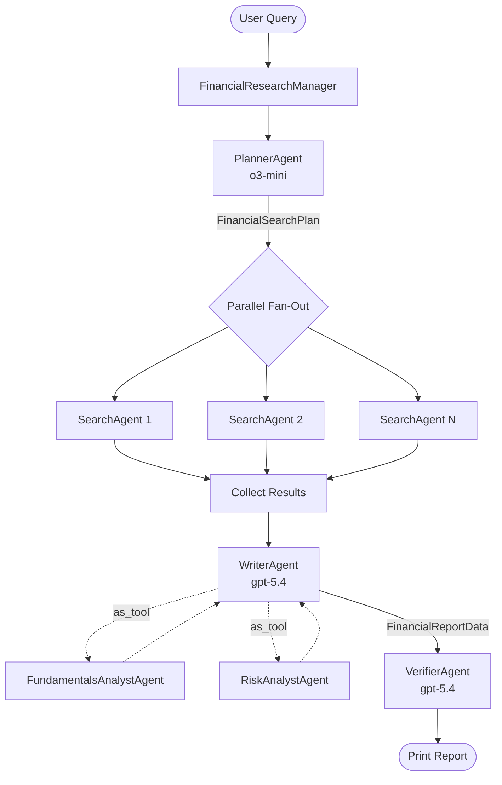
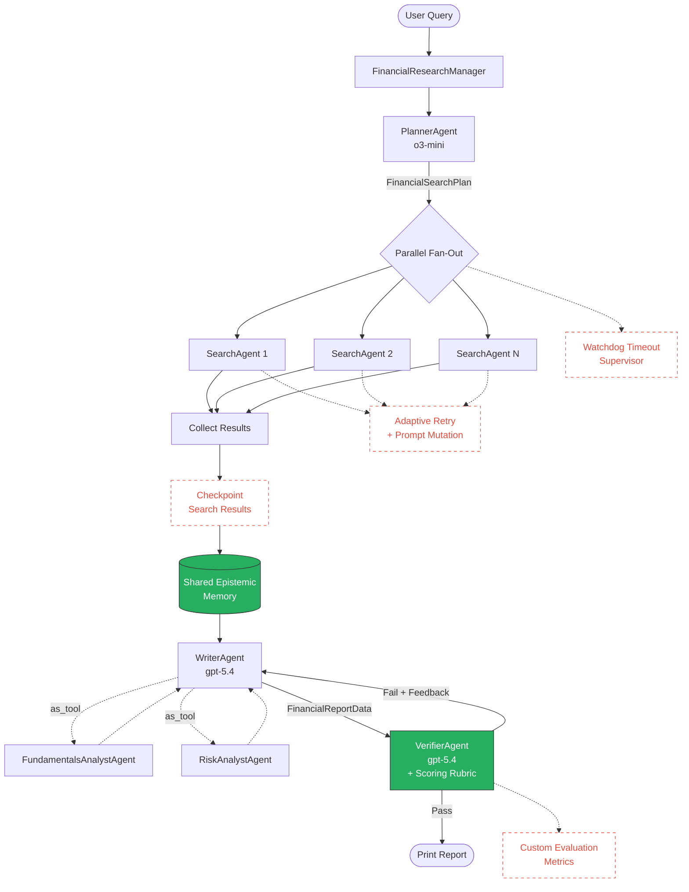

# Iconsult MCP

**Architecture consulting for multi-agent systems, grounded in the textbook.**

Iconsult is an MCP server that reviews your multi-agent architecture against a [knowledge graph](https://marcus-waldman.github.io/Iconsult_mcp/) of 141 concepts and 462 relationships extracted from [*Agentic Architectural Patterns for Building Multi-Agent Systems*](https://www.packtpub.com/en-us/product/agentic-architectural-patterns-for-building-multi-agent-systems-9781806029570) (Arsanjani & Bustos, Packt 2026). Every recommendation comes with chapter numbers, page references, and concrete code-level changes — not abstract advice.

This project was influenced by Piaget's theories of cognitive development in which learning occurs through the [adaptation of schemas](https://marcus-waldman.github.io/Iconsult_mcp/piaget-schema-adaptation.png).

## See It In Action

We pointed Iconsult at OpenAI's [Financial Research Agent](https://github.com/openai/openai-agents-python/tree/main/examples/financial_research_agent) — a 5-stage multi-agent pipeline from their Agents SDK — and asked it to assess architectural maturity.

[](https://www.youtube.com/watch?v=X96XEaWfoCE)

**[View the full interactive architecture review →](https://marcus-waldman.github.io/Iconsult_mcp/openai-financial-agent-review.html)**

### The agent's current architecture

The Financial Research Agent uses a **5-stage sequential pipeline** orchestrated by `FinancialResearchManager`. Search is the only concurrent stage — everything else runs in sequence, and the verifier is a terminal dead end:


```mermaid
flowchart TD
    User(["User Query"]) --> Manager["FinancialResearchManager"]
    Manager --> Planner["PlannerAgent\no3-mini"]
    Planner -->|"FinancialSearchPlan"| FanOut{"Parallel Fan-Out"}
    FanOut --> S1["SearchAgent 1"]
    FanOut --> S2["SearchAgent 2"]
    FanOut --> SN["SearchAgent N"]
    S1 --> Collect["Collect Results"]
    S2 --> Collect
    SN --> Collect
    Collect --> Writer["WriterAgent\ngpt-5.4"]
    Writer -.->|"as_tool"| Fundamentals["FundamentalsAnalystAgent"]
    Writer -.->|"as_tool"| Risk["RiskAnalystAgent"]
    Fundamentals -.-> Writer
    Risk -.-> Writer
    Writer -->|"FinancialReportData"| Verifier["VerifierAgent\ngpt-5.4"]
    Verifier --> Output(["Print Report"])
```

### What Iconsult found

Solid foundation — and Iconsult's [knowledge graph](https://marcus-waldman.github.io/Iconsult_mcp/) traversal identified key opportunities across 7 categories:

| Category | Rating | Key Finding |
|----------|--------|-------------|
| Coordination & Planning | Established | Solid supervisor + agent-as-tool delegation |
| Human-Agent Interaction | Emerging | Agent delegation works; no HITL checkpoints |
| Agent Capabilities | Emerging | WebSearchTool + structured outputs in place |
| Robustness | Not Started | 0% failure chain coverage; no retry, no timeout |
| Explainability | Not Started | No instruction anchoring or fidelity auditing |
| Infrastructure | Not Started | No event system, no auth, no registry |
| Continuous Improvement | Not Started | Verification is informational only |

### Recommended architecture

The natural next evolution — adding retry logic, checkpointing, shared memory, and a verification feedback loop:


```mermaid
flowchart TD
    User(["User Query"]) --> Manager["FinancialResearchManager"]
    Manager --> Planner["PlannerAgent\no3-mini"]
    Planner -->|"FinancialSearchPlan"| FanOut{"Parallel Fan-Out"}
    FanOut --> S1["SearchAgent 1"]
    FanOut --> S2["SearchAgent 2"]
    FanOut --> SN["SearchAgent N"]
    S1 --> Collect["Collect Results"]
    S2 --> Collect
    SN --> Collect

    FanOut -.-> WD["Watchdog Timeout\nSupervisor"]:::opportunity
    S1 -.-> RT["Adaptive Retry\n+ Prompt Mutation"]:::opportunity
    S2 -.-> RT
    SN -.-> RT

    Collect --> CP1["Checkpoint\nSearch Results"]:::opportunity
    CP1 --> SharedMem[("Shared Epistemic\nMemory")]:::newpattern
    SharedMem --> Writer["WriterAgent\ngpt-5.4"]
    Writer -.->|"as_tool"| Fundamentals["FundamentalsAnalystAgent"]
    Writer -.->|"as_tool"| Risk["RiskAnalystAgent"]
    Fundamentals -.-> Writer
    Risk -.-> Writer

    Writer -->|"FinancialReportData"| Verifier["VerifierAgent\ngpt-5.4\n+ Scoring Rubric"]:::newpattern
    Verifier -->|"Pass"| Output(["Print Report"])
    Verifier -->|"Fail + Feedback"| Writer
    Verifier -.-> Metrics["Custom Evaluation\nMetrics"]:::opportunity

    classDef opportunity fill:none,stroke:#E74C3C,stroke-dasharray:5 5,color:#E74C3C
    classDef newpattern fill:#27AE60,stroke:#333,color:white
```

### How it got there

The consultation followed Iconsult's 7-step guided workflow — **[view the visual workflow →](https://marcus-waldman.github.io/Iconsult_mcp/consultation-workflow.html)**

| Step | Tool(s) | What happened |
|------|---------|---------------|
| 1. **Read codebase** | — | Fetched `manager.py`, `agents/*.py`. Identified the orchestrator pattern, `.as_tool()` delegation, silent `except Exception: return None`, and terminal verifier. |
| 2. **Match concepts** | `match_concepts` | Embedded the project description (OpenAI `text-embedding-3-small`) and ranked all 141 concepts by cosine similarity against their pre-computed embeddings in the knowledge graph. Same input → same embedding → same ranking — no LLM judgment. Top hits: Multi-Agent Planning, Supervisor Architecture, Agent Delegates to Agent, AgentTool, Hybrid Planner+Scorer. |
| 2b. **Plan** | `plan_consultation` | Assessed complexity as **complex** (score 86/100 — 20 concepts, high relationship density). Generated 11-step adaptive plan. Complexity controls traversal depth: simple (3 concepts, 1 hop, 8 steps) → moderate (5 concepts, 2 hops, adds follow-up questions + optional critique, 10 steps) → complex (8 concepts, 2 hops, parallel subagents, second traversal round, mandatory critique, 11 steps). |
| 3. **Traverse graph** | `get_subgraph`, `log_pattern_assessment`, `emit_event` | 4 parallel subagents explored concept clusters across two traversal rounds (39 nodes, 45 edges). Logged 20 pattern assessments (7 implemented, 3 partial, 7 missing, 3 N/A). Emitted `gap_found` events for key opportunities. |
| 4. **Retrieve passages** | `ask_book` | Book passages scoped to discovered concepts — returned chapter numbers, page ranges, and quotes grounding each recommendation. |
| 5. **Coverage + Score + Stress test** | `consultation_report`, `score_architecture`, `generate_failure_scenarios` | `consultation_report` verifies 4 coverage dimensions from logged steps: concept coverage (matched concepts traversed or assessed / total matched), relationship type coverage (edge types seen / 10 possible), passage diversity (chapters + sections retrieved), and critical edge checks (`requires`/`conflicts_with` examined). Then `score_architecture` computed the 7-category maturity scorecard and `generate_failure_scenarios` produced 5 failure walkthroughs for missing patterns. |
| 5b. **Critique** | `critique_consultation` | No LLM — 7 rule-based checks against fixed thresholds (workflow completeness, traversal depth >= 3, assessments >= 5, coverage >= 50%, critical edges examined, etc.). Flagged 2 issues; backfilled 6 unexplored concepts. |
| 6. **Render report** | `render_report` | Generated the [interactive HTML report](https://marcus-waldman.github.io/Iconsult_mcp/openai-financial-agent-review.html) server-side — scores, scenarios, and coverage pulled from DB, merged with narrative content. |
| 7. **Implementation plan** | `generate_implementation_plan` | Offered step-by-step phased checklist (mechanical code changes vs. design decisions). |

## What It Does

Point it at a codebase (or describe your architecture), and it runs a structured consultation: matching concepts, traversing the [knowledge graph](https://marcus-waldman.github.io/Iconsult_mcp/) for prerequisites and conflicts, scoring maturity against a category-based rubric (7 categories × 3 levels from Ch. 12), and generating an interactive HTML review with before/after architecture diagrams.

### Tools (25)

**Consultation workflow:**

| Tool | Role | What it does |
|------|------|-------------|
| `match_concepts` | Entry point | Embeds a project description → deterministic concept ranking + `consultation_id` for session tracking |
| `plan_consultation` | Planning | Assesses complexity (simple/moderate/complex) and generates an adaptive step-by-step plan |
| `get_subgraph` | Graph traversal | Priority-queue BFS from seed concepts — discovers alternatives, prerequisites, conflicts, complements |
| `log_pattern_assessment` | Assessment | Records whether each pattern is implemented, partial, missing, or not applicable |
| `ask_book` | Deep context | RAG search against the book — returns passages with chapter, page numbers, and full text |
| `consultation_report` | Coverage | Computes concept/relationship coverage, identifies opportunities, optionally diffs two sessions |
| `score_architecture` | Scoring | Category-based maturity scorecard (7 categories × 3 levels) from logged pattern assessments; pattern ID aliases bridge KG ↔ rubric IDs |
| `generate_failure_scenarios` | Resilience analysis | Resilience scenarios for each opportunity — code-grounded or book-grounded, with Ch. 7 recovery chain mapping |
| `critique_consultation` | Quality | Structural critique with actionable fix suggestions; multi-iteration mode (1-3 passes) with convergence detection |
| `render_report` | Report rendering | Server-side HTML rendering — pulls scores/scenarios/coverage from DB, merges with narrative content, writes complete HTML with CSS/JS/zoom/tooltips |
| `supervise_consultation` | Supervision | Tracks workflow progress across 9 phases, suggests next action with tool + params |
| `generate_implementation_plan` | Implementation | Phased markdown checklist from consultation results; classifies steps as mechanical or design decision |
| `get_implementation_plan` | Implementation | Retrieve a previously generated plan with progress summary |
| `update_plan_step` | Implementation | Update step status (pending/in_progress/completed/skipped); recomputes summary |

**Coordination:**

| Tool | What it does |
|------|-------------|
| `write_state` / `read_state` | Shared key-value state for subagent coordination during traversal |
| `assert_fact` / `query_facts` | Blackboard Knowledge Hub — typed, versioned facts with conflict detection, confidence scores, and TTL |
| `emit_event` / `get_events` | Event-driven reactivity — emit events like `gap_found`, poll with filters, get reactive suggestions |

**Quality & utility:**

| Tool | What it does |
|------|-------------|
| `rate_consultation` | Record user quality score (1-5) and/or feedback with metadata snapshot |
| `consultation_analytics` | Surface quality trends across consultations (avg rating, coverage, distribution) |
| `list_concepts` | Browse/filter the full 138-concept catalogue |
| `validate_subagent` | Schema validation for subagent responses; optional semantic validation against the [knowledge graph](https://marcus-waldman.github.io/Iconsult_mcp/) |
| `health_check` | Server health + graph stats |

### Prompt

| Prompt | What it does |
|--------|-------------|
| `consult` | Kick off a full architecture consultation — provide your project context and get the guided workflow |

### The Knowledge Graph

```
141 concepts  ·  786 sections  ·  462 relationships  ·  1,248 concept-section mappings
```

Relationship types span `uses`, `extends`, `alternative_to`, `component_of`, `requires`, `enables`, `complements`, `specializes`, `precedes`, and `conflicts_with`.

#### How it was built

The graph was extracted from the book in 4 phases using Claude and OpenAI embeddings:

| Phase | What it does | Output |
|-------|-------------|--------|
| **1a — Parse Index** | Extract concept entries from the book's index (OCR-corrected) | 138 concepts with page references |
| **1b — Parse Book** | Segment the book into sections by heading structure | 786 sections across 16 chapters |
| **2 — Tag Concepts** | Claude maps each concept to relevant sections using index page numbers + semantic context | 1,248 concept-section mappings |
| **3a — Explicit Relationships** | Claude identifies relationships between concepts within each chapter | Typed edges (uses, requires, extends, etc.) |
| **3b — Semantic Pairs** | OpenAI embeddings find similar concepts across chapters; Claude validates and types the relationship | Cross-chapter semantic edges |
| **3c–3e — Cross-Chapter** | Three additional passes: knowledge-based, cross-chapter semantic, and summary-based structural relationships | 462 total relationships at avg 0.695 confidence |
| **4 — Build Graph** | Deduplicate edges, validate confidence thresholds, compute final embeddings from section content | Production-ready graph on MotherDuck |

See [`docs/development.md`](docs/development.md) for pipeline commands and technical details.

**[Explore the interactive knowledge graph →](https://marcus-waldman.github.io/Iconsult_mcp/)**

## Setup

### Prerequisites

- Python 3.10+
- A [MotherDuck](https://motherduck.com) account (free tier works)
- OpenAI API key (for embeddings used by `ask_book`)
- **Claude Code** (optionally with the [visual-explainer](https://github.com/nicobailon/visual-explainer) skill for ad-hoc diagrams outside consultations)

### Database Access

The [knowledge graph](https://marcus-waldman.github.io/Iconsult_mcp/) is hosted on MotherDuck and shared publicly. The server automatically detects whether you own the database or need to attach the public share — no extra configuration needed. Just provide your MotherDuck token and it works.

### Install visual-explainer (optional)

The [visual-explainer](https://github.com/nicobailon/visual-explainer) skill is no longer required for consultations — `render_report` now handles HTML rendering server-side. However, it remains useful for ad-hoc diagrams outside consultations:

```bash
git clone https://github.com/nicobailon/visual-explainer.git ~/.claude/skills/visual-explainer
mkdir -p ~/.claude/commands
cp ~/.claude/skills/visual-explainer/prompts/*.md ~/.claude/commands/
```

### Install

```bash
pip install git+https://github.com/marcus-waldman/Iconsult_mcp.git
```

For development:

```bash
git clone https://github.com/marcus-waldman/Iconsult_mcp.git
cd Iconsult_mcp
pip install -e .
```

### Environment Variables

```bash
export MOTHERDUCK_TOKEN="your-token"    # Required — database
export OPENAI_API_KEY="sk-..."          # Required — embeddings for ask_book
```

### MCP Configuration

Add to your Claude Desktop config (`claude_desktop_config.json`) or Claude Code settings:

```json
{
  "mcpServers": {
    "iconsult": {
      "command": "iconsult-mcp",
      "env": {
        "MOTHERDUCK_TOKEN": "your-token",
        "OPENAI_API_KEY": "sk-..."
      }
    }
  }
}
```

### Verify

```bash
iconsult-mcp --check
```

## License

AGPL-3.0 — see [LICENSE](LICENSE) for details.
